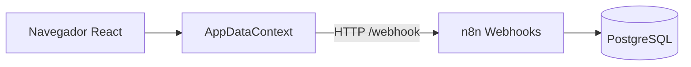

# Bold Support

Sistema de chamados (tickets) para suporte ao cliente. Backend em **n8n** com persistência em **PostgreSQL** (Supabase) e console web para agentes em **React**.

## Objetivo

Permitir cadastro de clientes, abertura e consulta de chamados, com histórico de interações - exposto via API HTTP para consumo por frontend e integrações.

## Funcionalidades

### Etapa 1 - API básica

- Listar clientes (`GET /clientes`)
- Cadastrar cliente (`POST /clientes`)
- Consultar cliente por ID (`GET /clientes/id/:id`)
- Criar ticket com protocolo e interação automática (`POST /tickets/criar`)
- Listar tickets com filtro por status e/ou prioridade (`GET /tickets/listar`)
- Consultar ticket com histórico de interações (`GET /tickets/id/:id`)

### Etapa 2 - Regras de negócio e integração

- Remover cliente sem tickets (`DELETE /clientes/remover/:id`)
- Remover ticket (`DELETE /tickets/remover/:id`)
- Atualizar status com transições validadas (`PATCH /tickets/atualizar-status/:id`)
- Adicionar interação (`POST /tickets/adicionar-interacao/:id`)
- Webhook HTTP externo em eventos de ticket

### Etapa 3 - Console do agente (frontend)

- Login split-screen com vídeo e identidade Bold
- Dashboard com métricas derivadas, últimos eventos e chamados recentes
- Fila kanban (4 colunas, drag-and-drop, ação rápida de status)
- Central de chamados (tabela desktop + cards mobile, filtros locais)
- Detalhe do chamado com timeline de interações
- Base de clientes e abertura de chamado pelo agente
- Integração com API n8n real (clientes, tickets, status, interações)
- Log de eventos derivados das mutações + polling opcional webhook.site
- Layout responsivo (sidebar colapsável, mobile nav, notificações)
- Tema claro/escuro

### Etapa 4 - Autenticação JWT

- Login por agente (`POST /auth/login`)
- JWT HS256 validado no n8n em cada rota protegida
- Sessão no frontend (`localStorage` / `sessionStorage`)
- Logout e redirect automático em token expirado

## Stack

| Camada | Tecnologia | Finalidade |
|--------|------------|------------|
| Backend | n8n (webhooks) | Orquestração, validação e resposta HTTP |
| Banco | PostgreSQL / Supabase | Persistência relacional |
| Frontend | React 19 + Vite 8 + Tailwind 4 + Framer Motion | Console do agente |
| Testes | Postman | Validação manual dos endpoints |

## Pré-requisitos

- Node.js 20+ (frontend)
- Conta Supabase (ou PostgreSQL 14+)
- Acesso à instância n8n
- Postman (recomendado)

## Branches (entregas por etapa)

O desafio exige divisão clara das entregas no GitHub:

| Branch | Etapa | Status |
|--------|-------|--------|
| [`stage/01-core-api`](../../tree/stage/01-core-api) | CRUD básico (5 rotas) | Concluída |
| [`stage/02-ticket-operations`](../../tree/stage/02-ticket-operations) | DELETE, PATCH, interações, webhook | Concluída |
| [`stage/03-frontend`](../../tree/stage/03-frontend) | Frontend React - console do agente | Concluída |
| [`stage/04-authentication`](../../tree/stage/04-authentication) | Autenticação JWT | Concluída |
| `main` | Última etapa estável | Etapas 1, 2, 3 e 4 |

Detalhes e checklist: [**docs/entregas.md**](docs/entregas.md)

```bash
git checkout stage/01-core-api           # revisar só a Etapa 1
git checkout stage/02-ticket-operations  # revisar Etapa 2
git checkout stage/03-frontend           # revisar Etapa 3
```

## Instalação rápida

```bash
# 1. Clonar
git clone <url-do-repositorio>
cd Bold-Support

# 2. Variáveis de ambiente (backend)
cp .env.example .env
# Editar .env com suas credenciais

# 3. Banco de dados
psql "$DATABASE_URL" -f database/migrations/001_initial_schema.sql
psql "$DATABASE_URL" -f database/migrations/002_agentes.sql
psql "$DATABASE_URL" -f database/migrations/003_app_config.sql

# 4. Importar workflows de n8n/workflows/ no n8n
# 5. Testar com Postman - ver docs/installation.md

# 6. Frontend
cd frontend
cp .env.example .env
npm install
npm run dev
```

Guia completo: [**docs/installation.md**](docs/installation.md)

## Variáveis de ambiente

### Backend (raiz)

| Variável | Descrição |
|----------|-----------|
| `DATABASE_URL` | Connection string PostgreSQL |
| `SUPABASE_URL` | URL do projeto Supabase |
| `N8N_WEBHOOK_BASE_URL` | Base URL dos webhooks n8n |
| `WEBHOOK_EXTERNO_URL` | URL do webhook mock (integração externa) |

Detalhes em [`.env.example`](.env.example).

### Frontend (`frontend/.env`)

| Variável | Descrição |
|----------|-----------|
| `VITE_N8N_WEBHOOK_BASE_URL` | Base URL dos webhooks n8n (`/webhook` em dev com proxy Vite) |
| `VITE_WEBHOOK_SITE_TOKEN` | (Opcional) UUID do webhook.site para sincronizar `/eventos` |

Detalhes em [`frontend/.env.example`](frontend/.env.example).

## Estrutura do projeto

```
Bold-Support/
├── database/migrations/       # Schema SQL
├── docs/
│   ├── architecture.md        # Arquitetura e fluxos
│   ├── api.md                 # Endpoints e exemplos
│   ├── database.md            # Modelagem e ER
│   ├── entregas.md            # Branches e checklist por etapa
│   ├── installation.md        # Guia de instalação
│   └── openapi.yaml           # Contrato OpenAPI 3
├── frontend/                  # React + Vite (console do agente)
│   ├── public/images/         # logobold.png, boldiconsidebar.png, boldfavicon.png
│   ├── public/videos/         # boldsupport.mp4 (painel de login)
│   └── src/
│       ├── pages/             # Dashboard, Fila, Chamados, Clientes, Eventos
│       ├── components/        # layout, dashboard, queue, tickets, ui
│       └── lib/
│           ├── store/         # AppDataContext (estado + API n8n)
│           ├── api/           # client.ts, clientes.ts, tickets.ts
│           └── types/         # Cliente, Ticket, Evento
├── n8n/workflows/             # Backend (10 workflows)
├── postman/                   # Collections Etapa 1 e 2 + environment
└── .env.example
```

## Frontend (Etapa 3)

Console do agente Bold - login em `/`, dashboard em `/dashboard`. Consumo da API n8n via proxy Vite em desenvolvimento (`/webhook` → `dev.boldsolution.com.br`).

```bash
cd frontend
npm install
npm run dev      # http://localhost:5173
npm run build
npm run lint
```

Documentação detalhada: [**frontend/README.md**](frontend/README.md)

Assets: favicon `boldfavicon.png` | sidebar `boldiconsidebar.png` | login `logobold.png` | vídeo `boldsupport.mp4`

## Arquitetura

Backend: cada rota HTTP é um workflow n8n (**Webhook → validação → Postgres → Respond**).

Frontend: SPA React com `AppDataContext` consumindo webhooks n8n via `lib/api/`.



Detalhes: [**docs/architecture.md**](docs/architecture.md)

## API

| Método | Rota lógica | Workflow |
|--------|-------------|----------|
| GET | `/clientes` | `GET_Clientes.json` |
| POST | `/clientes` | `POST_Clientes.json` |
| GET | `/clientes/id/:id` | `GET_Cliente_por_ID.json` |
| DELETE | `/clientes/remover/:id` | `DELETE_Cliente_por_ID.json` |
| POST | `/tickets/criar` | `POST_Tickets.json` |
| GET | `/tickets/listar` | `GET_Tickets.json` |
| GET | `/tickets/id/:id` | `GET_Ticket_por_ID.json` |
| DELETE | `/tickets/remover/:id` | `DELETE_Ticket_por_ID.json` |
| PATCH | `/tickets/atualizar-status/:id` | `PATCH_Ticket_Status.json` |
| POST | `/tickets/adicionar-interacao/:id` | `POST_Ticket_Interacao.json` |

> URLs de produção na instância Bold podem incluir `webhookId` no path - ver tabela completa em [docs/api.md](docs/api.md).

Documentação completa: [**docs/api.md**](docs/api.md) | OpenAPI: [**docs/openapi.yaml**](docs/openapi.yaml)

## Banco de dados

Três tabelas: `clientes`, `tickets`, `interacoes`.

Diagrama ER, índices e constraints: [**docs/database.md**](docs/database.md)

## Tratamento de erros

Respostas de erro no formato `{ "erro": "...", "codigo": "..." }` com HTTP 400 (validação) ou 404 (recurso não encontrado). Códigos documentados em [docs/api.md](docs/api.md).

## Autenticação

JWT (Etapa 4). Login em `POST /auth/login` com email e senha; rotas protegidas exigem `Authorization: Bearer <token>`. Detalhes em [docs/api.md](docs/api.md) e [docs/installation.md](docs/installation.md).

## Limitações conhecidas

- URLs n8n misturam path simples e path com `webhookId`, copiar Production URL de cada workflow.
- Paths da Etapa 2 usam prefixos únicos (`remover`, `atualizar-status`, `adicionar-interacao`), exigência do n8n hospedado.
- Webhook externo usa URL configurável; falha não bloqueia a API (`continueOnFail`).
- Sem portal self-service do cliente, o produto é console do agente Bold.
