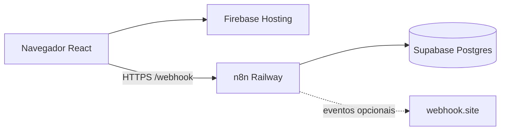

# Bold Support

Sistema de chamados (tickets) para suporte ao cliente. Backend em **n8n**, persistência em **PostgreSQL** (Supabase) e console web para agentes em **React**.

| Ambiente | URL |
|----------|-----|
| **App (produção)** | https://bold-support.web.app |
| **API (produção)** | `https://bold-support-production.up.railway.app/webhook` |
| **Repositório** | [github.com/Victorks4/Bold-Support](https://github.com/Victorks4/Bold-Support) |

**Login de teste:** `agente@bold.com` / `Bold@2026`

---

## Visão geral

O Bold Support permite que agentes Bold cadastrem clientes, abram e gerenciem chamados, acompanhem a fila de atendimento e registrem interações, com API HTTP para integrações externas via webhook.



| Camada | Tecnologia | Responsabilidade |
|--------|------------|------------------|
| Frontend | React 19 + Vite 8 + Tailwind 4 | Console do agente (SPA) |
| Hosting | Firebase Hosting | Arquivos estáticos (`frontend/dist`) |
| Backend | n8n 1.123+ (webhooks) | Orquestração, validação, JWT, resposta HTTP |
| Deploy backend | Railway + Docker | Instância n8n própria |
| Banco da app | PostgreSQL / Supabase | Clientes, tickets, interações, agentes |
| Banco do n8n | PostgreSQL Railway | Metadados do n8n (workflows, credenciais) |
| Testes | Vitest + Newman | 47 testes frontend + integração API |

> **Escopo:** console do agente Bold. Portal self-service do cliente final não está incluído.

Detalhes: [**docs/architecture.md**](docs/architecture.md)

---

## Funcionalidades por etapa

### Etapa 1 - API básica

| Método | Rota | Descrição |
|--------|------|-----------|
| GET | `/clientes` | Listar clientes |
| POST | `/clientes` | Cadastrar cliente |
| GET | `/clientes/id/:id` | Consultar cliente por ID |
| POST | `/tickets/criar` | Criar ticket com protocolo e interação automática |
| GET | `/tickets/listar` | Listar tickets (filtro por status e/ou prioridade) |
| GET | `/tickets/id/:id` | Consultar ticket com histórico de interações |

### Etapa 2 - Regras de negócio e integração

| Método | Rota | Descrição |
|--------|------|-----------|
| DELETE | `/clientes/remover/:id` | Remover cliente sem tickets (409 se possui chamados) |
| DELETE | `/tickets/remover/:id` | Remover ticket (CASCADE nas interações) |
| PATCH | `/tickets/atualizar-status/:id` | Atualizar status com matriz de transições |
| POST | `/tickets/adicionar-interacao/:id` | Adicionar interação (`cliente` / `agente`) |
| - | Webhook HTTP externo | `status_alterado`, `interacao_adicionada`, `ticket_excluido` |

### Etapa 3 - Console do agente (frontend)

| Rota | Tela |
|------|------|
| `/` | Login split-screen (vídeo + identidade Bold) |
| `/dashboard` | Métricas, últimos eventos e chamados recentes |
| `/fila` | Kanban 4 colunas com drag-and-drop |
| `/chamados` | Lista com filtros (tabela desktop + cards mobile) |
| `/chamados/:id` | Detalhe + timeline de interações |
| `/clientes` | Cadastro de cliente e abertura de chamado |
| `/eventos` | Log de eventos (API + polling webhook.site opcional) |

- Integração real com API n8n (`AppDataContext`, `lib/api/`)
- Tema claro/escuro, layout responsivo, code splitting e lazy loading
- Validações: telefone 10-11 dígitos, descrição até 1000 caracteres
- Atualização otimista ao registrar interações no detalhe do chamado

### Etapa 4 - Autenticação JWT

| Método | Rota | Auth |
|--------|------|------|
| POST | `/auth/login` | Pública |
| Demais rotas | - | `Authorization: Bearer <token>` |

- JWT HS256 gerado e validado no n8n (`jwt_secret` em `app_config`)
- `AuthContext`, rotas protegidas, logout e redirect em token expirado

Checklist completo: [**docs/entregas.md**](docs/entregas.md)

---

## Branches (entregas do desafio)

| Branch | Etapa | Status |
|--------|-------|--------|
| [`stage/01-core-api`](../../tree/stage/01-core-api) | CRUD básico (5 rotas) | Concluída |
| [`stage/02-ticket-operations`](../../tree/stage/02-ticket-operations) | DELETE, PATCH, interações, webhook | Concluída |
| [`stage/03-frontend`](../../tree/stage/03-frontend) | Console React do agente | Concluída |
| [`stage/04-authentication`](../../tree/stage/04-authentication) | Autenticação JWT | Concluída |
| `main` | Última etapa estável | Etapas 1-4 integradas |

```bash
git checkout stage/01-core-api            # revisar só a Etapa 1
git checkout stage/02-ticket-operations # revisar Etapa 2
git checkout stage/03-frontend            # revisar Etapa 3
git checkout stage/04-authentication      # revisar Etapa 4
```

---

## Início rápido

### Pré-requisitos

- Node.js 20+
- Conta Supabase (ou PostgreSQL 14+)
- Instância n8n (local, Railway ou Bold Solution)
- Postman (opcional)

### 1. Clonar e instalar

```bash
git clone https://github.com/Victorks4/Bold-Support.git
cd Bold-Support

npm install                    # Newman (testes API)
cd frontend && npm install     # React + Vitest
```

### 2. Variáveis de ambiente

```bash
cp .env.example .env
cp .env.test.example .env.test
cd frontend && cp .env.example .env
```

| Arquivo | Uso |
|---------|-----|
| `.env` | Desenvolvimento local (Supabase, URLs n8n) |
| `.env.test` | Testes Newman (`API_BASE_URL`, credenciais do agente) |
| `.env.railway` | Import de workflows via API (`cp .env.railway.example .env.railway`) |
| `frontend/.env` | Dev local (proxy Vite `/webhook`) |
| `frontend/.env.production` | Build Firebase (URLs públicas) |

> Não commite: `.env`, `.env.railway`, `.env.test`, `frontend/dist/`, `.firebase/`

### 3. Banco de dados

```bash
psql "$DATABASE_URL" -f database/migrations/001_initial_schema.sql
psql "$DATABASE_URL" -f database/migrations/002_agentes.sql
psql "$DATABASE_URL" -f database/migrations/003_app_config.sql
```

### 4. Workflows n8n

Importar os 11 JSONs de `n8n/workflows/`:

```bash
npm run n8n:import
```

Guia completo: [**docs/installation.md**](docs/installation.md)

### 5. Frontend

```bash
cd frontend
npm run dev    # http://localhost:5173
```

---

## Scripts (raiz)

| Comando | Descrição |
|---------|-----------|
| `npm test` | Vitest (frontend) + Newman (API) |
| `npm run test:frontend` | 47 testes unitários (offline) |
| `npm run test:api` | Integração Etapas 4 → 1 → 2 (n8n ativo) |
| `npm run n8n:import` | Importa/atualiza workflows no Railway via API |
| `npm run n8n:fix-if` | Corrige nodes IF nos JSONs exportados |

---

## Testes

```bash
# Na raiz do projeto
npm test

# Separado
npm run test:frontend
npm run test:api
```

Configure `.env.test` com `API_BASE_URL` apontando para sua instância n8n.

| Suite | Ferramenta | Escopo |
|-------|------------|--------|
| Frontend | Vitest + Testing Library | Utils, API client, auth, componentes |
| API | Newman (Postman CLI) | Login JWT, CRUD, PATCH, interações, DELETE |

Guia: [**docs/testing.md**](docs/testing.md)

---

## Deploy em produção

| Componente | Plataforma | Guia |
|------------|------------|------|
| Backend (n8n) | Railway + Docker | [**docs/deployment-backend.md**](docs/deployment-backend.md) |
| Frontend (SPA) | Firebase Hosting | [**docs/deployment-frontend.md**](docs/deployment-frontend.md) |

```bash
# Backend: push no GitHub → Railway detecta railway.toml + deploy/n8n/Dockerfile
npm run n8n:import

# Frontend
npm run build --prefix frontend
firebase deploy --only hosting --project bold-support
```

**Docker local (opcional):**

```bash
cd deploy/n8n
cp .env.example .env
docker compose up -d    # http://localhost:5678
```

---

## API

### Rotas e workflows

| Método | Rota | Workflow | Auth |
|--------|------|----------|------|
| POST | `/auth/login` | `POST_Auth_Login.json` | - |
| GET | `/clientes` | `GET_Clientes.json` | JWT |
| POST | `/clientes` | `POST_Clientes.json` | JWT |
| GET | `/clientes/id/:id` | `GET_Cliente_por_ID.json` | JWT |
| DELETE | `/clientes/remover/:id` | `DELETE_Cliente_por_ID.json` | JWT |
| POST | `/tickets/criar` | `POST_Tickets.json` | JWT |
| GET | `/tickets/listar` | `GET_Tickets.json` | JWT |
| GET | `/tickets/id/:id` | `GET_Ticket_por_ID.json` | JWT |
| PATCH | `/tickets/atualizar-status/:id` | `PATCH_Ticket_Status.json` | JWT |
| POST | `/tickets/adicionar-interacao/:id` | `POST_Ticket_Interacao.json` | JWT |
| DELETE | `/tickets/remover/:id` | `DELETE_Ticket_por_ID.json` | JWT |

> Algumas rotas usam `webhookId` no path (ex.: `bold-patch-ticket-status`). Copie a **Production URL** de cada workflow no n8n.

### Padrão dos workflows

```
Webhook_1 → Extrair_token → Validar_JWT → Validar_payload → IF → Postgres → Responde_*
```

- Erros: `{ "erro": "...", "codigo": "..." }` (400 validação, 404 não encontrado, 409 conflito)
- SQL parametrizado (`$1`, `$2`) nos nodes Postgres
- JWT em JS puro: `n8n/snippets/jwt-pure-inline.js`

Documentação: [**docs/api.md**](docs/api.md) | OpenAPI: [**docs/openapi.yaml**](docs/openapi.yaml) | Postman: `postman/`

---

## Banco de dados

| Tabela | Função |
|--------|--------|
| `clientes` | Cadastro de clientes |
| `tickets` | Chamados (protocolo, status, prioridade) |
| `interacoes` | Timeline (`sistema`, `cliente`, `agente`) |
| `agentes` | Login JWT (`senha_hash` com `crypt`) |
| `app_config` | `jwt_secret` e configurações |

**Regras principais:**

- Cliente com tickets → `DELETE` bloqueado (`ON DELETE RESTRICT`, 409)
- Excluir ticket → interações removidas (`ON DELETE CASCADE`)
- Status com matriz de transições (não é update livre)

Diagrama ER e constraints: [**docs/database.md**](docs/database.md)

---

## Estrutura do projeto

```
Bold-Support/
├── database/migrations/          # Schema SQL (001-003)
├── deploy/n8n/
│   ├── Dockerfile                # n8n 1.123+ (CORS PATCH/DELETE)
│   └── docker-compose.yml        # Teste local
├── docs/
│   ├── architecture.md           # Diagramas e decisões
│   ├── api.md                    # Endpoints e códigos de erro
│   ├── database.md               # ER, índices, constraints
│   ├── deployment-backend.md     # Railway + n8n
│   ├── deployment-frontend.md    # Firebase Hosting
│   ├── entregas.md               # Branches e checklist por etapa
│   ├── installation.md           # Setup completo
│   ├── testing.md                # Vitest + Newman
│   └── openapi.yaml
├── frontend/                     # React 19 + Vite 8
│   ├── .env.production           # URLs de build Firebase
│   └── src/
│       ├── pages/                # Dashboard, Fila, Chamados, Clientes, Eventos
│       ├── components/           # layout, dashboard, queue, tickets, ui
│       ├── hooks/                # useReducedMotion, useIsDesktopLoginPanel
│       └── lib/
│           ├── store/            # AppDataContext
│           ├── api/              # client, clientes, tickets, ticket-parse
│           ├── auth/             # AuthContext, token-storage
│           ├── constants/        # limites de campos
│           └── utils/            # validação, métricas, máscaras
├── n8n/
│   ├── workflows/                # 11 workflows exportados
│   └── snippets/                 # jwt-pure-inline.js
├── postman/                      # Collections Etapas 1, 2 e 4
├── scripts/
│   ├── import-n8n-workflows.mjs  # Deploy workflows via API n8n
│   ├── fix-n8n-if-nodes.mjs
│   └── run-api-tests.mjs
├── firebase.json                 # Firebase Hosting
├── .firebaserc
├── railway.toml                  # Deploy n8n no Railway
├── .env.example
└── .env.railway.example
```

Frontend detalhado: [**frontend/README.md**](frontend/README.md)

---

## Variáveis de ambiente

### Backend (raiz - `.env`)

| Variável | Descrição |
|----------|-----------|
| `DATABASE_URL` | Connection string PostgreSQL (Supabase) |
| `SUPABASE_URL` | URL do projeto Supabase |
| `N8N_WEBHOOK_BASE_URL` | Base dos webhooks n8n |
| `WEBHOOK_EXTERNO_URL` | URL do webhook externo (webhook.site) |

### Frontend (`frontend/.env`)

| Variável | Descrição |
|----------|-----------|
| `VITE_N8N_WEBHOOK_BASE_URL` | Base dos webhooks (`/webhook` em dev com proxy Vite) |
| `VITE_WEBHOOK_SITE_TOKEN` | (Opcional) UUID webhook.site para `/eventos` |

### Railway (import workflows - `.env.railway`)

| Variável | Descrição |
|----------|-----------|
| `N8N_BASE_URL` | URL da instância n8n |
| `N8N_API_KEY` | API key do n8n (Settings → API) |

---

## Documentação

| Documento | Conteúdo |
|-----------|----------|
| [installation.md](docs/installation.md) | Setup Supabase, n8n, Postman, JWT |
| [architecture.md](docs/architecture.md) | Camadas, fluxos, convenções n8n |
| [api.md](docs/api.md) | Contrato HTTP completo |
| [database.md](docs/database.md) | Modelo relacional |
| [testing.md](docs/testing.md) | Testes automatizados |
| [deployment-backend.md](docs/deployment-backend.md) | Railway, Docker, CORS |
| [deployment-frontend.md](docs/deployment-frontend.md) | Firebase Hosting |
| [entregas.md](docs/entregas.md) | Branches e checklist do desafio |

---

## Limitações conhecidas

- URLs n8n podem misturar path simples e path com `webhookId`; usar Production URL de cada workflow.
- Paths da Etapa 2 usam prefixos únicos (`remover`, `atualizar-status`, `adicionar-interacao`).
- Webhook externo com `continueOnFail`: falha não bloqueia a operação principal.
- Produto focado no console do agente; sem portal self-service para o cliente final.

---

## Licença

Projeto desenvolvido como desafio técnico **Bold Solution**.
