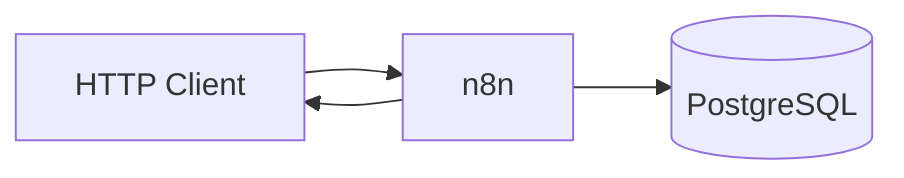

# Bold Support

Sistema de chamados (tickets) para suporte ao cliente. Backend em **n8n** com persistência em **PostgreSQL** (Supabase).

## Objetivo

Permitir cadastro de clientes, abertura e consulta de chamados, com histórico de interações — exposto via API HTTP para consumo por frontend e integrações.

## Funcionalidades

### Etapa 1 — API básica

- Cadastrar cliente (`POST /clientes`)
- Consultar cliente por ID (`GET /clientes/:id`)
- Criar ticket com protocolo e interação automática (`POST /tickets`)
- Listar tickets com filtro por status e/ou prioridade (`GET /tickets`)
- Consultar ticket com histórico de interações (`GET /tickets/:id`)

### Etapa 2 — Regras de negócio e integração

- Remover cliente sem tickets (`DELETE /clientes/remover/:id`)
- Remover ticket (`DELETE /tickets/remover/:id`)
- Atualizar status com transições validadas (`PATCH /tickets/atualizar-status/:id`)
- Adicionar interação (`POST /tickets/adicionar-interacao/:id`)
- Webhook HTTP externo em eventos de ticket

## Stack

| Camada | Tecnologia | Finalidade |
|--------|------------|------------|
| Backend | n8n (webhooks) | Orquestração, validação e resposta HTTP |
| Banco | PostgreSQL / Supabase | Persistência relacional |
| Testes | Postman | Validação manual dos endpoints |
| Frontend | React + Vite | Tela de login (Etapa 3 em andamento) |

## Pré-requisitos

- Conta Supabase (ou PostgreSQL 14+)
- Acesso à instância n8n
- Postman (recomendado)

## Branches (entregas por etapa)

O desafio exige divisão clara das entregas no GitHub:

| Branch | Etapa | Status |
|--------|-------|--------|
| [`stage/01-core-api`](../../tree/stage/01-core-api) | CRUD básico (5 rotas) | Concluída |
| [`stage/02-ticket-operations`](../../tree/stage/02-ticket-operations) | DELETE, PATCH, interações, webhook | Concluída |
| [`stage/03-frontend`](../../tree/stage/03-frontend) | Frontend React — login | Em andamento |
| [`stage/04-authentication`](../../tree/stage/04-authentication) | Autenticação | Pendente |
| `main` | Última etapa estável | Etapas 1 e 2 |

Detalhes e checklist: [**docs/entregas.md**](docs/entregas.md)

```bash
git checkout stage/01-core-api    # revisar só a Etapa 1
git checkout stage/02-ticket-operations  # revisar Etapa 2
git checkout stage/03-frontend    # próxima etapa
```

## Instalação rápida

```bash
# 1. Clonar
git clone <url-do-repositorio>
cd Bold-Support

# 2. Variáveis de ambiente
cp .env.example .env
# Editar .env com suas credenciais

# 3. Banco de dados
psql "$DATABASE_URL" -f database/migrations/001_initial_schema.sql

# 4. Importar workflows de n8n/workflows/ no n8n
# 5. Testar com Postman — ver docs/installation.md
```

Guia completo: [**docs/installation.md**](docs/installation.md)

## Variáveis de ambiente

| Variável | Descrição |
|----------|-----------|
| `DATABASE_URL` | Connection string PostgreSQL |
| `SUPABASE_URL` | URL do projeto Supabase |
| `N8N_WEBHOOK_BASE_URL` | Base URL dos webhooks n8n |
| `WEBHOOK_EXTERNO_URL` | URL do webhook mock (integração externa) |

Detalhes em [`.env.example`](.env.example).

## Estrutura do projeto

```
Bold-Support/
├── database/migrations/       # Schema SQL
├── docs/
│   ├── architecture.md          # Arquitetura e fluxos
│   ├── api.md                   # Endpoints e exemplos
│   ├── database.md              # Modelagem e ER
│   ├── installation.md          # Guia de instalação
│   └── openapi.yaml             # Contrato OpenAPI 3
├── frontend/                    # React + Vite (login)
│   └── public/videos/           # Vídeo do painel esquerdo (login.mp4)
├── n8n/workflows/               # Backend (9 workflows)
├── postman/                     # Collection de testes
└── .env.example
```

## Frontend (Etapa 3)

Tela de login estilo Pointfy — split-screen com vídeo à esquerda e formulário à direita.

```bash
cd frontend
npm install
npm run dev
```

Coloque o vídeo em `frontend/public/videos/login.mp4` (não versionado no Git).

## Arquitetura

Cada rota HTTP é um workflow n8n: **Webhook → validação → Postgres → Respond**.



Detalhes: [**docs/architecture.md**](docs/architecture.md)

## API

| Método | Rota | Workflow |
|--------|------|----------|
| POST | `/clientes` | `POST_Clientes.json` |
| GET | `/clientes/:id` | `GET_Cliente_por_ID.json` |
| DELETE | `/clientes/remover/:id` | `DELETE_Cliente_por_ID.json` |
| POST | `/tickets` | `POST_Tickets.json` |
| GET | `/tickets` | `GET_Tickets.json` |
| GET | `/tickets/:id` | `GET_Ticket_por_ID.json` |
| DELETE | `/tickets/remover/:id` | `DELETE_Ticket_por_ID.json` |
| PATCH | `/tickets/atualizar-status/:id` | `PATCH_Ticket_Status.json` |
| POST | `/tickets/adicionar-interacao/:id` | `POST_Ticket_Interacao.json` |

Documentação completa: [**docs/api.md**](docs/api.md) | OpenAPI: [**docs/openapi.yaml**](docs/openapi.yaml)

## Banco de dados

Três tabelas: `clientes`, `tickets`, `interacoes`.

Diagrama ER, índices e constraints: [**docs/database.md**](docs/database.md)

## Tratamento de erros

Respostas de erro no formato `{ "erro": "...", "codigo": "..." }` com HTTP 400 (validação) ou 404 (recurso não encontrado). Códigos documentados em [docs/api.md](docs/api.md).

## Autenticação

**Não implementada** (prevista para Etapa 4).

## Limitações conhecidas

- Etapa 3: apenas tela de login (UI estática); dashboard e auth pendentes.
- Paths da Etapa 2 usam prefixos únicos (`remover`, `atualizar-status`, `adicionar-interacao`) — exigência do n8n hospedado.
- Webhook externo usa URL configurável; falha não bloqueia a API (`continueOnFail`).


