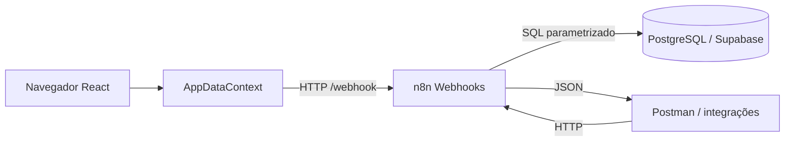
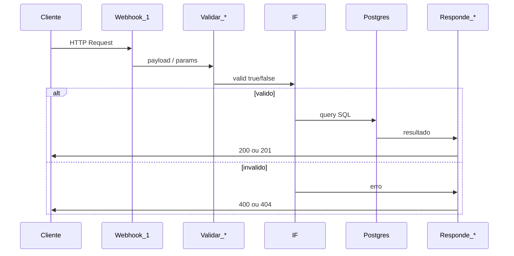
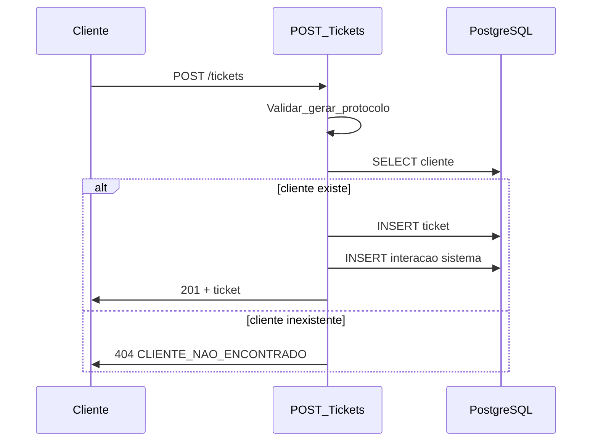
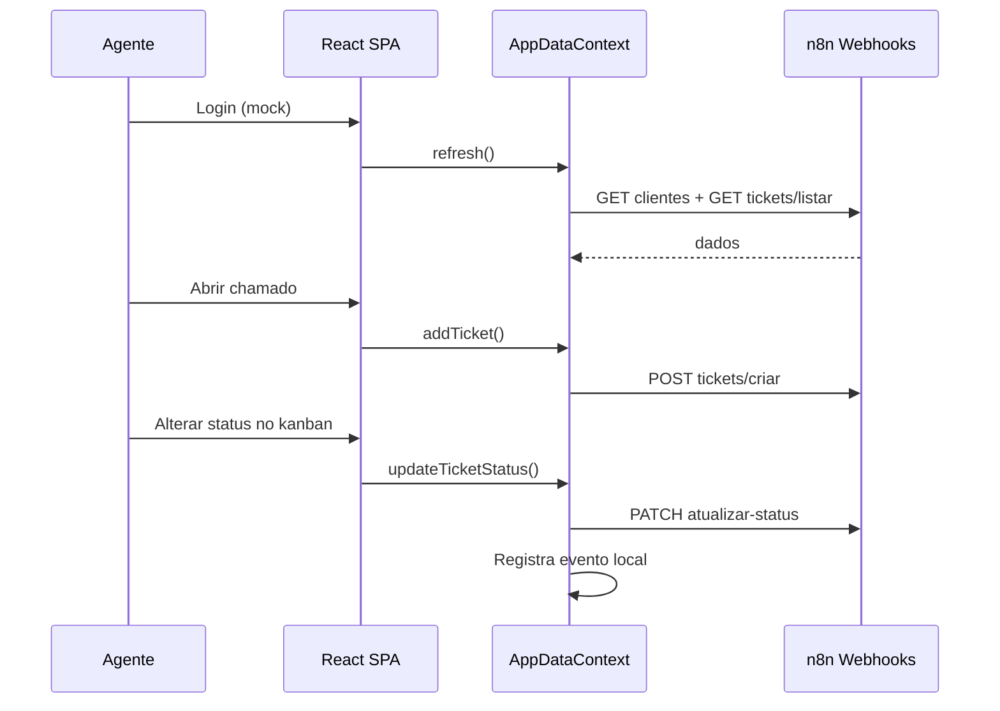

# Arquitetura - Bold Support

## Visão geral

Bold Support é um sistema de chamados (tickets) com backend implementado em **n8n**, persistência em **PostgreSQL** (Supabase) e frontend **React** (console do agente). Cada rota HTTP do backend é um workflow n8n independente que orquestra validação, consulta ao banco e resposta JSON.



## Camadas e responsabilidades

| Camada | Tecnologia | Responsabilidade |
|--------|------------|------------------|
| Entrada HTTP | n8n Webhook | Receber GET/POST, expor path da rota |
| Validação | n8n Code + IF | Validar payload, UUID, filtros e enums |
| Persistência | n8n Postgres | Executar SQL (`$1`, `$2`…) |
| Saída HTTP | n8n Respond to Webhook | Retornar JSON com status 200/201/400/404 |

## Padrão: um workflow por rota

| Workflow (n8n) | Arquivo | Método | Path (node Webhook) |
|----------------|---------|--------|---------------------|
| GET Clientes | `n8n/workflows/GET_Clientes.json` | GET | `clientes` |
| POST Clientes | `n8n/workflows/POST_Clientes.json` | POST | `clientes` |
| GET Cliente por ID | `n8n/workflows/GET_Cliente_por_ID.json` | GET | `clientes/id/:id` |
| POST Tickets | `n8n/workflows/POST_Tickets.json` | POST | `tickets/criar` |
| GET Tickets | `n8n/workflows/GET_Tickets.json` | GET | `tickets/listar` |
| GET Ticket por ID | `n8n/workflows/GET_Ticket_por_ID.json` | GET | `tickets/id/:id` |
| PATCH Status | `n8n/workflows/PATCH_Ticket_Status.json` | PATCH | `tickets/atualizar-status/:id` |
| POST Interação | `n8n/workflows/POST_Ticket_Interacao.json` | POST | `tickets/adicionar-interacao/:id` |
| DELETE Ticket | `n8n/workflows/DELETE_Ticket_por_ID.json` | DELETE | `tickets/remover/:id` |
| DELETE Cliente | `n8n/workflows/DELETE_Cliente_por_ID.json` | DELETE | `clientes/remover/:id` |

## Fluxo de uma requisição (padrão)



## Fluxo: abertura de ticket



## Convenções nos workflows

- **Nodes:** nomenclatura `nome_nome` (ex.: `Validar_payload`, `Buscar_cliente`)
- **Respostas:** `Responde_200`, `Responde_201`, `Responde_400`, `Responde_404`
- **Webhook:** modo `Using Respond to Webhook Node`
- **Postgres com 0 linhas:** `Always Output Data = ON` nos nodes de busca (permite fluxo até 404)

## Autenticação

JWT (Etapa 4). `POST /auth/login` emite o token; demais rotas exigem `Authorization: Bearer <token>`. Workflows n8n validam HMAC-SHA256 com `jwt_secret` em `app_config`. Detalhes em [api.md](api.md) e [installation.md](installation.md).

## Frontend (Etapa 3)

SPA React em `frontend/` com **react-router-dom**. Estado global em `AppDataContext` consumindo a API n8n via `lib/api/` (proxy Vite `/webhook` em desenvolvimento).

### Camadas do frontend

| Camada | Localização | Responsabilidade |
|--------|-------------|------------------|
| Rotas | `src/App.tsx`, `src/pages/` | Navegação e composição de telas |
| Layout | `src/components/layout/` | Sidebar, TopBar, AppShell, MobileNav |
| Domínio | `src/components/{dashboard,queue,tickets,clients,events}/` | UI por feature |
| Estado | `src/lib/store/AppDataContext.tsx` | Bootstrap API, CRUD, eventos derivados |
| API | `src/lib/api/` | `client.ts`, `clientes.ts`, `tickets.ts`, `webhook-site.ts` |
| Tipos | `src/lib/types/` | `Cliente`, `Ticket`, `WebhookEvento` |
| Utilitários | `src/lib/utils/` | Métricas do dashboard, kanban DnD, formatação |
| Tema | `src/lib/theme/ThemeProvider.tsx` | Modo claro/escuro (localStorage) |

### Rotas do frontend

| Rota | Componente | Descrição |
|------|------------|-----------|
| `/` | `LoginPage` | Login mock (sem auth real) |
| `/dashboard` | `DashboardPage` | Métricas e visão geral |
| `/fila` | `QueuePage` | Kanban 4 colunas |
| `/chamados` | `TicketsPage` | Lista com filtros |
| `/chamados/:id` | `TicketDetailPage` | Detalhe + timeline |
| `/clientes` | `ClientsPage` | Cadastro + abrir chamado |
| `/eventos` | `EventsPage` | Log simulado de webhooks |

### Fluxo do agente (integrado)



> **Escopo:** console do agente Bold. Não há portal self-service para o cliente final.

## Estrutura de diretórios

```
Bold-Support/
├── database/migrations/    # Schema SQL versionado
├── docs/                   # Documentação técnica
├── frontend/               # SPA React (console do agente)
│   └── src/
│       ├── pages/          # Telas por rota
│       ├── components/     # UI e layout
│       └── lib/            # store, mocks, api, types
├── n8n/workflows/          # Workflows exportados (backend)
├── postman/                # Collection de testes manuais
└── .env.example            # Variáveis de ambiente (placeholders)
```

## Decisões arquiteturais

| Decisão | Motivo |
|---------|--------|
| n8n como backend | Exigência do desafio técnico |
| Workflow por rota | Isolamento, demonstração clara na avaliação |
| SQL parametrizado (`$1`) | Prevenção de SQL injection |
| Erros com `{ erro, codigo }` | Contrato consistente para o frontend |
| Protocolo gerado no Code node | Legibilidade sem dependência extra no banco |

## Dependências externas

| Serviço | Uso |
|---------|-----|
| n8n (Bold Solution) | Execução dos workflows e webhooks |
| Supabase / PostgreSQL | Persistência de clientes, tickets e interações |

Produção na instância Bold: `/webhook/{path}` ou `/webhook/{webhookId}/{path}` conforme o workflow (ver `docs/api.md`). Teste: `/webhook-test/{path}` com Listen ativo.

## Etapa 2 - Operações e integração (implementada)

| Rota | Regra de negócio |
|------|------------------|
| `DELETE /clientes/remover/:id` | Bloqueia se cliente possui tickets (409) |
| `DELETE /tickets/remover/:id` | CASCADE em interações; webhook `ticket_excluido` |
| `PATCH /tickets/atualizar-status/:id` | Matriz de transições; interação sistema; webhook `status_alterado` |
| `POST /tickets/adicionar-interacao/:id` | Tipos `cliente`/`agente`; webhook `interacao_adicionada` |

## Etapas futuras (não implementadas)

- Autenticação JWT/OAuth (Etapa 4)
