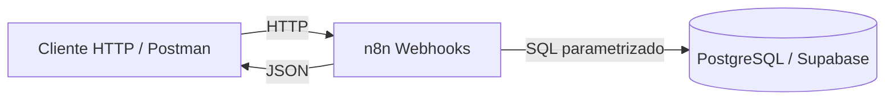
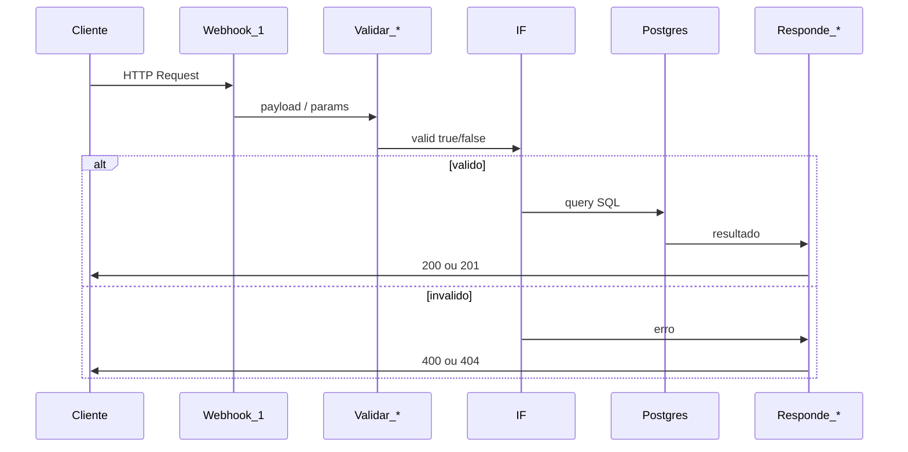
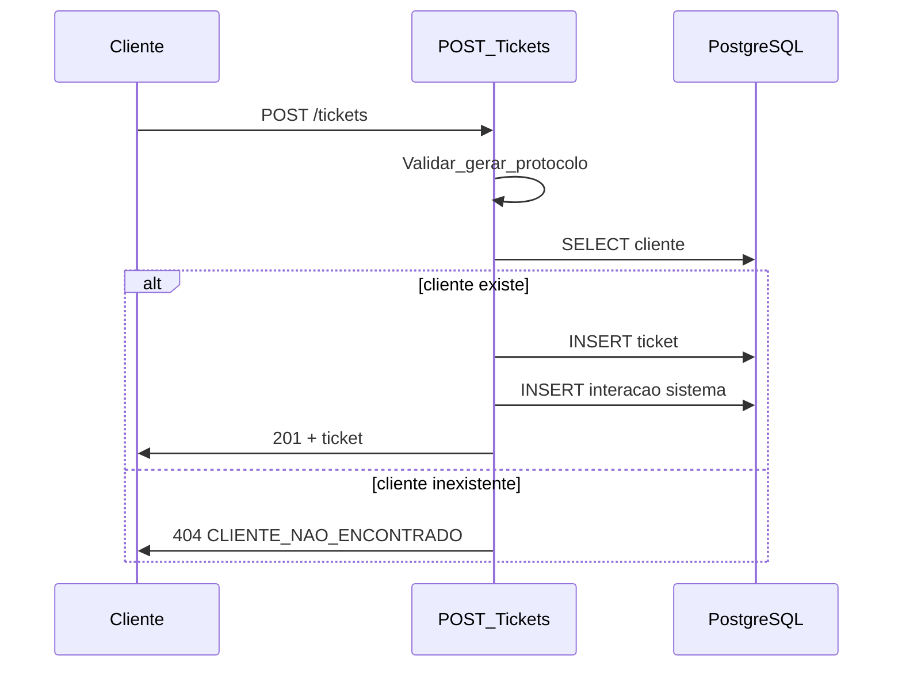

# Arquitetura — Bold Support

## Visão geral

Bold Support é um sistema de chamados (tickets) com backend implementado em **n8n** e persistência em **PostgreSQL** (Supabase). Cada rota HTTP é um workflow n8n independente que orquestra validação, consulta ao banco e resposta JSON.

O frontend React está previsto para a Etapa 3 e **não está presente** no repositório atual.



## Camadas e responsabilidades

| Camada | Tecnologia | Responsabilidade |
|--------|------------|------------------|
| Entrada HTTP | n8n Webhook | Receber GET/POST, expor path da rota |
| Validação | n8n Code + IF | Validar payload, UUID, filtros e enums |
| Persistência | n8n Postgres | Executar SQL (`$1`, `$2`…) |
| Saída HTTP | n8n Respond to Webhook | Retornar JSON com status 200/201/400/404 |

## Padrão: um workflow por rota

| Workflow (n8n) | Arquivo | Método | Path |
|----------------|---------|--------|------|
| POST Clientes | `n8n/workflows/POST_Clientes.json` | POST | `/clientes` |
| GET Cliente por ID | `n8n/workflows/GET_Cliente_por_ID.json` | GET | `/clientes/:id` |
| POST Tickets | `n8n/workflows/POST_Tickets.json` | POST | `/tickets` |
| GET Tickets | `n8n/workflows/GET_Tickets.json` | GET | `/tickets` |
| GET Ticket por ID | `n8n/workflows/GET_Ticket_por_ID.json` | GET | `/tickets/:id` |

## Fluxo de uma requisição (padrão)



## Fluxo: abertura de ticket



## Convenções nos workflows

- **Nodes:** nomenclatura `nome_nome` (ex.: `Validar_payload`, `Buscar_cliente`)
- **Respostas:** `Responde_200`, `Responde_201`, `Responde_400`, `Responde_404`
- **Webhook:** modo `Using Respond to Webhook Node`
- **Postgres com 0 linhas:** `Always Output Data = ON` nos nodes de busca (permite fluxo até 404)

## Autenticação

**Não identificado no código.** As rotas da Etapa 1 são públicas. Autenticação entre frontend e backend é requisito futuro do desafio (Etapa 4).

## Estrutura de diretórios

```
Bold-Support/
├── database/migrations/    # Schema SQL versionado
├── docs/                   # Documentação técnica
├── n8n/workflows/          # Workflows exportados (backend)
├── postman/                # Collection de testes manuais
└── .env.example            # Variáveis de ambiente (placeholders)
```

## Decisões arquiteturais

| Decisão | Motivo |
|---------|--------|
| n8n como backend | Exigência do desafio técnico |
| Workflow por rota | Isolamento, demonstração clara na avaliação |
| SQL parametrizado (`$1`) | Prevenção de SQL injection |
| Erros com `{ erro, codigo }` | Contrato consistente para o frontend |
| Protocolo gerado no Code node | Legibilidade sem dependência extra no banco |

## Dependências externas

| Serviço | Uso |
|---------|-----|
| n8n (Bold Solution) | Execução dos workflows e webhooks |
| Supabase / PostgreSQL | Persistência de clientes, tickets e interações |

> **Necessita confirmação:** URL e disponibilidade do n8n em produção (`/webhook` vs `/webhook-test`) dependem da configuração da instância hospedada.

## Etapas futuras (não implementadas)

- DELETE cliente/ticket, PATCH status, POST interações
- Webhook externo em eventos de ticket
- Frontend React consumindo a API
- Autenticação JWT/OAuth
