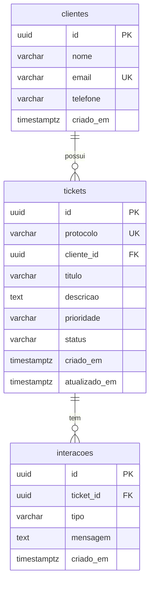

# Banco de dados — Bold Support

## Tecnologia

- **SGBD:** PostgreSQL
- **Provedor:** Supabase (compatível com qualquer instância PostgreSQL 14+)
- **Migration:** [`database/migrations/001_initial_schema.sql`](../database/migrations/001_initial_schema.sql)

Não há seeders no repositório. Dados iniciais são criados via API (`POST /clientes`, `POST /tickets`).

## Diagrama ER



## Tabelas

### `clientes`

| Coluna | Tipo | Restrições | Descrição |
|--------|------|------------|-----------|
| `id` | UUID | PK, default `gen_random_uuid()` | Identificador |
| `nome` | VARCHAR(150) | NOT NULL | Nome do cliente |
| `email` | VARCHAR(255) | NOT NULL, UNIQUE | E-mail |
| `telefone` | VARCHAR(20) | NOT NULL | Telefone |
| `criado_em` | TIMESTAMPTZ | NOT NULL, default `now()` | Data de cadastro |

### `tickets`

| Coluna | Tipo | Restrições | Descrição |
|--------|------|------------|-----------|
| `id` | UUID | PK, default `gen_random_uuid()` | Identificador |
| `protocolo` | VARCHAR(30) | NOT NULL, UNIQUE | Ex.: `TKT-20260910-A3F2` |
| `cliente_id` | UUID | NOT NULL, FK → `clientes(id)` | Cliente vinculado |
| `titulo` | VARCHAR(200) | NOT NULL | Título do chamado |
| `descricao` | TEXT | NOT NULL | Descrição detalhada |
| `prioridade` | VARCHAR(20) | NOT NULL, default `media` | `baixa`, `media`, `alta` |
| `status` | VARCHAR(30) | NOT NULL, default `aberto` | Ver enums abaixo |
| `criado_em` | TIMESTAMPTZ | NOT NULL, default `now()` | Criação |
| `atualizado_em` | TIMESTAMPTZ | NOT NULL, default `now()` | Última atualização |

### `interacoes`

| Coluna | Tipo | Restrições | Descrição |
|--------|------|------------|-----------|
| `id` | UUID | PK, default `gen_random_uuid()` | Identificador |
| `ticket_id` | UUID | NOT NULL, FK → `tickets(id)` ON DELETE CASCADE | Ticket vinculado |
| `tipo` | VARCHAR(30) | NOT NULL, default `sistema` | `sistema`, `cliente`, `agente` |
| `mensagem` | TEXT | NOT NULL | Conteúdo da interação |
| `criado_em` | TIMESTAMPTZ | NOT NULL, default `now()` | Data do registro |

## Enums (CHECK constraints)

| Campo | Valores permitidos | Default |
|-------|-------------------|---------|
| `tickets.prioridade` | `baixa`, `media`, `alta` | `media` |
| `tickets.status` | `aberto`, `em_atendimento`, `aguardando_cliente`, `resolvido`, `cancelado` | `aberto` |
| `interacoes.tipo` | `sistema`, `cliente`, `agente` | `sistema` |

## Relacionamentos e integridade

| Relação | Comportamento |
|---------|---------------|
| `tickets.cliente_id` → `clientes.id` | `ON DELETE RESTRICT` — não permite excluir cliente com tickets |
| `interacoes.ticket_id` → `tickets.id` | `ON DELETE CASCADE` — interações removidas com o ticket |

## Índices

| Índice | Coluna(s) | Finalidade |
|--------|-----------|------------|
| `idx_tickets_cliente_id` | `tickets.cliente_id` | Busca por cliente |
| `idx_tickets_status` | `tickets.status` | Filtro por status |
| `idx_tickets_prioridade` | `tickets.prioridade` | Filtro por prioridade |
| `idx_interacoes_ticket_id` | `interacoes.ticket_id` | Histórico do ticket |

## Migração

Aplicar o schema inicial:

```bash
psql "$DATABASE_URL" -f database/migrations/001_initial_schema.sql
```

No Supabase: SQL Editor → colar o conteúdo do arquivo → Run.

**Reset completo (cuidado — apaga dados):**

```sql
DROP TABLE IF EXISTS interacoes, tickets, clientes CASCADE;
-- Em seguida, executar novamente a migration.
```

## Decisões de modelagem

| Decisão | Escolha | Justificativa |
|---------|---------|---------------|
| IDs | UUID | Seguro em APIs públicas; padrão Supabase |
| E-mail único | `UNIQUE` | Evita clientes duplicados |
| Protocolo | `TKT-YYYYMMDD-XXXX` | Legível para o usuário; gerado no n8n |
| DELETE cliente | `RESTRICT` | Protege tickets vinculados (Etapa 2 definirá remoção) |
| DELETE ticket | `CASCADE` em interações | Histórico vinculado ao ciclo de vida do ticket |
