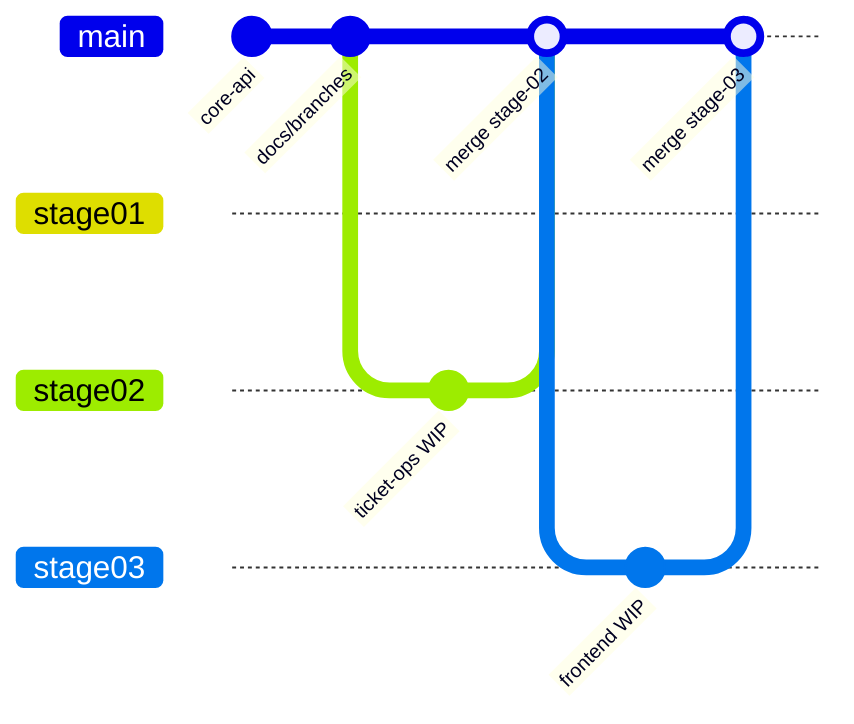

# Entregas por etapa — Bold Support

Este documento descreve a divisão de branches no GitHub conforme solicitado no desafio técnico Bold Solution.

## Convenção de nomenclatura

Padrão: `stage/<número>-<descrição>` — prefixo `stage/` agrupa entregas, número com zero à esquerda garante ordenação, nome em kebab-case descreve o escopo.

## Estratégia de branches

| Branch | Etapa | Conteúdo | Status |
|--------|-------|----------|--------|
| `main` | — | Última etapa estável entregue | Etapas 1, 2 e 3 |
| `stage/01-core-api` | 1 | Snapshot congelado — CRUD básico (5 rotas) | Concluída |
| `stage/02-ticket-operations` | 2 | DELETE, PATCH status, interações, webhook externo | Concluída |
| `stage/03-frontend` | 3 | Frontend React — console do agente | Concluída |
| `stage/04-authentication` | 4 | Autenticação JWT/OAuth | Pendente |

### Fluxo de trabalho



1. Desenvolver na branch da etapa atual.
2. Ao concluir a etapa: merge em `main`, atualizar este documento e congelar snapshot (`git branch -f stage/0N-...`).
3. Avaliadores podem fazer checkout da branch específica para revisar apenas aquela entrega.

### Comandos úteis

```bash
# Ver todas as branches
git branch -a

# Revisar só a Etapa 1
git checkout stage/01-core-api

# Revisar Etapa 3 (frontend)
git checkout stage/03-frontend
```

## Etapa 1 — Concluída

**Branch:** `stage/01-core-api`

| Método | Rota | Workflow |
|--------|------|----------|
| POST | `/clientes` | `POST_Clientes.json` |
| GET | `/clientes/:id` | `GET_Cliente_por_ID.json` |
| POST | `/tickets` | `POST_Tickets.json` |
| GET | `/tickets` | `GET_Tickets.json` |
| GET | `/tickets/:id` | `GET_Ticket_por_ID.json` |

## Etapa 2 — Concluída

**Branch:** `stage/02-ticket-operations`

| Método | Rota | Workflow | Status |
|--------|------|----------|--------|
| DELETE | `/clientes/remover/:id` | `DELETE_Cliente_por_ID.json` | Concluído |
| DELETE | `/tickets/remover/:id` | `DELETE_Ticket_por_ID.json` | Concluído |
| PATCH | `/tickets/atualizar-status/:id` | `PATCH_Ticket_Status.json` | Concluído |
| POST | `/tickets/adicionar-interacao/:id` | `POST_Ticket_Interacao.json` | Concluído |
| — | Webhook HTTP externo | Nodes em PATCH/DELETE/POST | Concluído |

### Checklist Etapa 2

- [x] DELETE cliente (tratar `RESTRICT` → 409 `CLIENTE_POSSUI_TICKETS`)
- [x] DELETE ticket (CASCADE remove interações)
- [x] PATCH status com validação de enum, transições e `atualizado_em`
- [x] POST interação com tipos `cliente` / `agente`
- [x] Disparo HTTP externo (protocolo, evento, status)
- [x] Exportar JSONs em `n8n/workflows/`
- [x] Atualizar `docs/api.md`, `docs/openapi.yaml` e `README.md`
- [x] Testar com Postman (produção `/webhook`, workflows ativos)

## Etapa 3 — Concluída

**Branch:** `stage/03-frontend`

### Rotas do frontend

| Rota | Tela |
|------|------|
| `/` | Login (mock) |
| `/dashboard` | Visão geral do atendimento |
| `/fila` | Kanban — 4 colunas |
| `/chamados` | Lista com filtros |
| `/chamados/:id` | Detalhe + timeline |
| `/clientes` | Cadastro + abrir chamado |
| `/eventos` | Log simulado de webhooks |

### Checklist Etapa 3

- [x] Projeto React + Vite + Tailwind em `frontend/`
- [x] Tela de login split-screen (estilo Pointfy)
- [x] Painel esquerdo com `<video>` (`public/videos/boldsupport.mp4`)
- [x] Formulário email/senha (UI estática — auth na Etapa 4)
- [x] Shell do app (sidebar, topbar) — identidade Bold Support
- [x] Dashboard agente (métricas derivadas, últimos eventos, chamados recentes)
- [x] Fila kanban (4 colunas incl. Encerrados, drag-and-drop, ação rápida de status)
- [x] Central de chamados (tabela desktop + cards mobile, filtros locais)
- [x] Detalhe do chamado com timeline, registro do cliente e remoção
- [x] Layout responsivo (MobileNav, sidebar colapsável, TopBar com notificações)
- [x] Métricas do dashboard derivadas dos tickets mock
- [x] Badge contador na Fila (sidebar + mobile nav)
- [x] Links eventos → chamado no log de webhooks
- [x] Base de clientes + abrir chamado (fluxo agente, mock em memória)
- [x] Eventos — log simulado de webhooks n8n (status/interação)
- [x] Motion: Framer Motion (páginas, sidebar, timeline, kanban)
- [x] Tema claro/escuro (`ThemeProvider`, toggle na sidebar)
- [x] Tipos, logger e stub de API para integração futura
- [x] Documentação atualizada (README, architecture, installation, entregas)
- [x] Merge em `main`
- [ ] Integração com API n8n real (pendente — não bloqueia entrega da Etapa 3)

> **Fora de escopo:** portal self-service do cliente — o produto é console do agente Bold.

## Etapa 4 — Pendente

**Branch:** `stage/04-authentication` — Autenticação entre frontend e backend.
