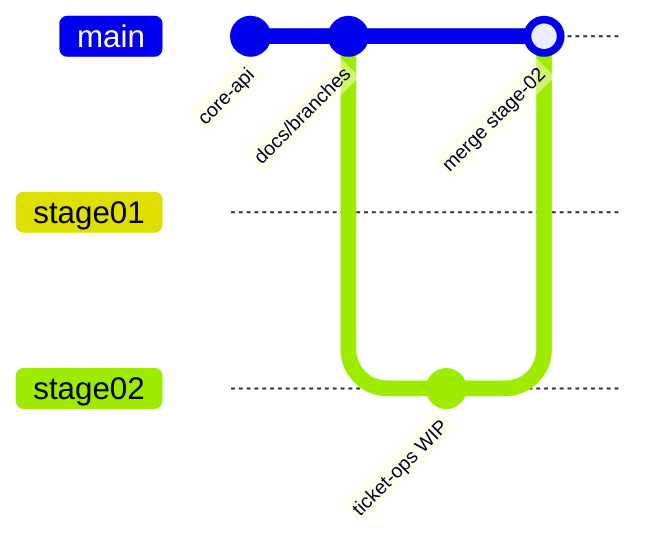

# Entregas por etapa — Bold Support

Este documento descreve a divisão de branches no GitHub conforme solicitado no desafio técnico Bold Solution.

## Convenção de nomenclatura

Padrão: `stage/<número>-<descrição>` — prefixo `stage/` agrupa entregas, número com zero à esquerda garante ordenação, nome em kebab-case descreve o escopo.

## Estratégia de branches

| Branch | Etapa | Conteúdo | Status |
|--------|-------|----------|--------|
| `main` | — | Última etapa estável entregue | Etapa 1 (merge da Etapa 2 pendente) |
| `stage/01-core-api` | 1 | Snapshot congelado — CRUD básico (5 rotas) | Concluída |
| `stage/02-ticket-operations` | 2 | DELETE, PATCH status, interações, webhook externo | Concluída |
| `stage/03-frontend` | 3 | Frontend React + Vite | Pendente |
| `stage/04-authentication` | 4 | Autenticação JWT/OAuth | Pendente |

### Fluxo de trabalho



1. Desenvolver na branch da etapa atual (`stage/02-ticket-operations`).
2. Ao concluir a etapa: merge em `main`, atualizar este documento e congelar snapshot (`git branch -f stage/0N-...`).
3. Avaliadores podem fazer checkout da branch específica para revisar apenas aquela entrega.

### Comandos úteis

```bash
# Ver todas as branches
git branch -a

# Revisar só a Etapa 1
git checkout stage/01-core-api

# Continuar desenvolvimento (Etapa 2)
git checkout stage/02-ticket-operations
```

## Etapa 1 — Concluída

**Branch:** `stage/01-core-api`

| Método | Rota | Workflow |
|--------|------|----------|
| POST | `/clientes` | `POST_Clientes.json` |
| GET | `/clientes/:id` | `GET_Cliente_por_ID.json` |
| POST | `/tickets` | `POST_Tickets.json` |
| GET | `/tickets` | `GET_Tickets.json` |
| GET | `/tickets/:id` | `GET_Ticket_por_ID.json` |

## Etapa 2 — Concluída

**Branch:** `stage/02-ticket-operations`

| Método | Rota | Workflow | Status |
|--------|------|----------|--------|
| DELETE | `/clientes/remover/:id` | `DELETE_Cliente_por_ID.json` | Concluído |
| DELETE | `/tickets/remover/:id` | `DELETE_Ticket_por_ID.json` | Concluído |
| PATCH | `/tickets/atualizar-status/:id` | `PATCH_Ticket_Status.json` | Concluído |
| POST | `/tickets/adicionar-interacao/:id` | `POST_Ticket_Interacao.json` | Concluído |
| — | Webhook HTTP externo | Nodes em PATCH/DELETE/POST | Concluído |

### Checklist Etapa 2

- [x] DELETE cliente (tratar `RESTRICT` → 409 `CLIENTE_POSSUI_TICKETS`)
- [x] DELETE ticket (CASCADE remove interações)
- [x] PATCH status com validação de enum, transições e `atualizado_em`
- [x] POST interação com tipos `cliente` / `agente`
- [x] Disparo HTTP externo (protocolo, evento, status)
- [x] Exportar JSONs em `n8n/workflows/`
- [x] Atualizar `docs/api.md`, `docs/openapi.yaml` e `README.md`
- [x] Testar com Postman (produção `/webhook`, workflows ativos)

## Etapa 3 — Pendente

**Branch:** `stage/03-frontend` — React + Vite consumindo a API n8n.

## Etapa 4 — Pendente

**Branch:** `stage/04-authentication` — Autenticação entre frontend e backend.
