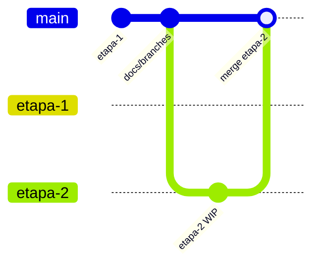

# Entregas por etapa — Bold Support

Este documento descreve a divisão de branches no GitHub conforme solicitado no desafio técnico Bold Solution.

## Estratégia de branches

| Branch | Conteúdo | Status |
|--------|----------|--------|
| `main` | Última etapa estável entregue | Etapa 1 concluída |
| `etapa-1` | Snapshot congelado da Etapa 1 (CRUD básico) | Concluída |
| `etapa-2` | Etapa 1 + DELETE, PATCH status, interações, webhook externo | Em desenvolvimento |
| `etapa-3` | Etapa 2 + frontend React | Pendente |
| `etapa-4` | Etapa 3 + autenticação | Pendente |

### Fluxo de trabalho



1. Desenvolver na branch da etapa atual (`etapa-2` agora).
2. Ao concluir a etapa: merge em `main`, atualizar este documento e congelar snapshot (`git branch -f etapa-N`).
3. Avaliadores podem fazer checkout da branch específica para revisar apenas aquela entrega.

### Comandos úteis

```bash
# Ver todas as branches
git branch -a

# Revisar só a Etapa 1
git checkout etapa-1

# Continuar desenvolvimento (Etapa 2)
git checkout etapa-2
```

## Etapa 1 — Concluída

**Branch:** `etapa-1`

| Método | Rota | Workflow |
|--------|------|----------|
| POST | `/clientes` | `POST_Clientes.json` |
| GET | `/clientes/:id` | `GET_Cliente_por_ID.json` |
| POST | `/tickets` | `POST_Tickets.json` |
| GET | `/tickets` | `GET_Tickets.json` |
| GET | `/tickets/:id` | `GET_Ticket_por_ID.json` |

## Etapa 2 — Em desenvolvimento

**Branch:** `etapa-2`

| Método | Rota | Workflow (a criar) | Status |
|--------|------|-------------------|--------|
| DELETE | `/clientes/:id` | `DELETE_Cliente_por_ID.json` | Pendente |
| DELETE | `/tickets/:id` | `DELETE_Ticket_por_ID.json` | Pendente |
| PATCH | `/tickets/:id/status` | `PATCH_Ticket_Status.json` | Pendente |
| POST | `/tickets/:id/interacoes` | `POST_Ticket_Interacao.json` | Pendente |
| — | Webhook HTTP externo | `WEBHOOK_Ticket_Evento.json` | Pendente |

### Checklist Etapa 2

- [ ] DELETE cliente (tratar `RESTRICT` se cliente tem tickets)
- [ ] DELETE ticket (CASCADE remove interações)
- [ ] PATCH status com validação de enum e `atualizado_em`
- [ ] POST interação com tipos `cliente` / `agente` / `sistema`
- [ ] Disparo HTTP externo em eventos de ticket (protocolo, evento, status)
- [ ] Exportar JSONs em `n8n/workflows/`
- [ ] Atualizar `docs/api.md`, `docs/openapi.yaml` e `README.md`
- [ ] Testar com Postman (Listen for test event)

## Etapa 3 — Pendente

Frontend React + Vite consumindo a API n8n.

## Etapa 4 — Pendente

Autenticação (JWT/OAuth) entre frontend e backend.
