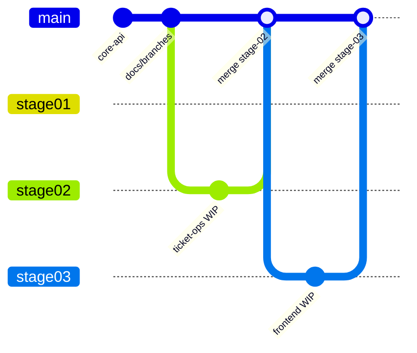

# Entregas por etapa - Bold Support

Este documento descreve a divisão de branches no GitHub conforme solicitado no desafio técnico Bold Solution.

## Convenção de nomenclatura

Padrão: `stage/<número>-<descrição>` - prefixo `stage/` agrupa entregas, número com zero à esquerda garante ordenação, nome em kebab-case descreve o escopo.

## Estratégia de branches

| Branch | Etapa | Conteúdo | Status |
|--------|-------|----------|--------|
| `main` | - | Última etapa estável entregue | Etapas 1, 2, 3 e 4 |
| `stage/01-core-api` | 1 | Snapshot congelado - CRUD básico (5 rotas) | Concluída |
| `stage/02-ticket-operations` | 2 | DELETE, PATCH status, interações, webhook externo | Concluída |
| `stage/03-frontend` | 3 | Frontend React - console do agente | Concluída |
| `stage/04-authentication` | 4 | Autenticação JWT por agente | Concluída |

### Fluxo de trabalho



1. Desenvolver na branch da etapa atual.
2. Ao concluir a etapa: merge em `main`, atualizar este documento e congelar snapshot (`git branch -f stage/0N-...`).
3. Avaliadores podem fazer checkout da branch específica para revisar apenas aquela entrega.

### Comandos úteis

```bash
# Ver todas as branches
git branch -a

# Revisar só a Etapa 1
git checkout stage/01-core-api

# Revisar Etapa 3 (frontend)
git checkout stage/03-frontend
```

## Etapa 1 - Concluída

**Branch:** `stage/01-core-api`

| Método | Rota | Workflow |
|--------|------|----------|
| POST | `/clientes` | `POST_Clientes.json` |
| GET | `/clientes/:id` | `GET_Cliente_por_ID.json` |
| POST | `/tickets` | `POST_Tickets.json` |
| GET | `/tickets` | `GET_Tickets.json` |
| GET | `/tickets/:id` | `GET_Ticket_por_ID.json` |

## Etapa 2 - Concluída

**Branch:** `stage/02-ticket-operations`

| Método | Rota | Workflow | Status |
|--------|------|----------|--------|
| DELETE | `/clientes/remover/:id` | `DELETE_Cliente_por_ID.json` | Concluído |
| DELETE | `/tickets/remover/:id` | `DELETE_Ticket_por_ID.json` | Concluído |
| PATCH | `/tickets/atualizar-status/:id` | `PATCH_Ticket_Status.json` | Concluído |
| POST | `/tickets/adicionar-interacao/:id` | `POST_Ticket_Interacao.json` | Concluído |
| - | Webhook HTTP externo | Nodes em PATCH/DELETE/POST | Concluído |

### Checklist Etapa 2

- [x] DELETE cliente (tratar `RESTRICT` → 409 `CLIENTE_POSSUI_TICKETS`)
- [x] DELETE ticket (CASCADE remove interações)
- [x] PATCH status com validação de enum, transições e `atualizado_em`
- [x] POST interação com tipos `cliente` / `agente`
- [x] Disparo HTTP externo (protocolo, evento, status)
- [x] Exportar JSONs em `n8n/workflows/`
- [x] Atualizar `docs/api.md`, `docs/openapi.yaml` e `README.md`
- [x] Testar com Postman (produção `/webhook`, workflows ativos)

## Etapa 3 - Concluída

**Branch:** `stage/03-frontend`

### Rotas do frontend

| Rota | Tela |
|------|------|
| `/` | Login (JWT - agente Bold) |
| `/dashboard` | Visão geral do atendimento |
| `/fila` | Kanban - 4 colunas |
| `/chamados` | Lista com filtros |
| `/chamados/:id` | Detalhe + timeline |
| `/clientes` | Cadastro + abrir chamado |
| `/eventos` | Log de eventos (API + webhook.site opcional) |

### Checklist Etapa 3

- [x] Projeto React + Vite + Tailwind em `frontend/`
- [x] Tela de login split-screen (estilo Pointfy)
- [x] Painel esquerdo com `<video>` (`public/videos/boldsupport.mp4`)
- [x] Formulário email/senha (UI estática - auth na Etapa 4)
- [x] Shell do app (sidebar, topbar) - identidade Bold Support
- [x] Dashboard agente (métricas derivadas, últimos eventos, chamados recentes)
- [x] Fila kanban (4 colunas incl. Encerrados, drag-and-drop, ação rápida de status)
- [x] Central de chamados (tabela desktop + cards mobile, filtros locais)
- [x] Detalhe do chamado com timeline, registro do cliente e remoção
- [x] Layout responsivo (MobileNav, sidebar colapsável, TopBar com notificações)
- [x] Métricas do dashboard derivadas dos tickets reais (API)
- [x] Badge contador na Fila (sidebar + mobile nav)
- [x] Links eventos → chamado no log de webhooks
- [x] Base de clientes + abrir chamado (fluxo agente via API)
- [x] Eventos - log local derivado das mutações API + polling webhook.site opcional
- [x] URLs n8n alinhadas (path simples + webhookId por rota na instância Bold)
- [x] Workflows POST/PATCH corrigidos (SQL via Code nodes)
- [x] Postman Etapa 1 e 2 + environment de produção
- [x] Motion: Framer Motion (páginas, sidebar, timeline, kanban)
- [x] Tema claro/escuro (`ThemeProvider`, toggle na sidebar)
- [x] Camada `lib/api` consumindo os 10 workflows n8n (incl. `GET /clientes`)
- [x] Bootstrap tickets (5 requests por status) + ordenação por prioridade no client-side
- [x] Proxy Vite `/webhook` para desenvolvimento local
- [x] Documentação atualizada (README, architecture, installation, entregas)
- [x] Merge em `main`
- [x] Integração com API n8n real (`AppDataContext`, loading/erro, refresh)

> **Fora de escopo:** portal self-service do cliente - o produto é console do agente Bold.

## Etapa 4 - Concluída

**Branch:** `stage/04-authentication`

| Método | Rota | Workflow | Auth |
|--------|------|----------|------|
| POST | `/auth/login` | `POST_Auth_Login.json` | Pública |
| * | Demais rotas | Workflows existentes | Bearer JWT |

### Checklist Etapa 4

- [x] Migration `002_agentes.sql` + seed agente teste
- [x] Workflow `POST_Auth_Login.json` (validação `crypt()` no Postgres)
- [x] Snippet `n8n/snippets/jwt-pure-inline.js` (HMAC-SHA256 em JS puro)
- [x] Proteção JWT nos 10 workflows (Extrair_token → Validar_JWT → 401)
- [x] `AuthContext`, `token-storage`, rotas protegidas no React
- [x] Login real + logout + TopBar com agente logado
- [x] `apiFetch` com Bearer + handler `401 TOKEN_INVALIDO`
- [x] Docs (`api.md`, `openapi.yaml`, `installation.md`, `database.md`)
- [x] Postman Etapa 4 + `access_token` no environment

## Testes automatizados - Concluído

### Frontend (Vitest)

- [x] Configuração Vitest + Testing Library em `frontend/`
- [x] Testes unitários: form-validation, ticket-sort, dashboard-metrics, kanban-dnd
- [x] Testes de api/client e token-storage
- [x] Testes de componente: LoginForm, ProtectedRoute

### API (Newman)

- [x] `package.json` na raiz com scripts de teste
- [x] `scripts/run-api-tests.mjs` — Etapa 4 → 1 → 2
- [x] `.env.test.example`
- [x] Collections Postman normalizadas com variáveis
- [x] Documentação em `docs/testing.md`

## Deploy em produção - Concluído

| Componente | URL | Guia |
|------------|-----|------|
| Backend n8n (Railway) | https://bold-support-production.up.railway.app | [deployment-backend.md](deployment-backend.md) |
| Frontend (Firebase) | https://bold-support.web.app | [deployment-frontend.md](deployment-frontend.md) |
| Webhook externo | webhook.site (configurado nos workflows) | [installation.md](installation.md) |

### Checklist deploy

- [x] n8n 1.123+ no Railway (CORS PATCH/DELETE)
- [x] `npm run n8n:import` — 11 workflows com Postgres
- [x] Firebase Hosting (`firebase.json`, `.firebaserc`)
- [x] `frontend/.env.production` com URLs Railway + webhook.site
- [x] Scripts `import-n8n-workflows.mjs` e `fix-n8n-if-nodes.mjs`
- [x] Validação frontend: telefone 11 dígitos, descrição 1000 chars
- [x] Lazy loading + code splitting no frontend
